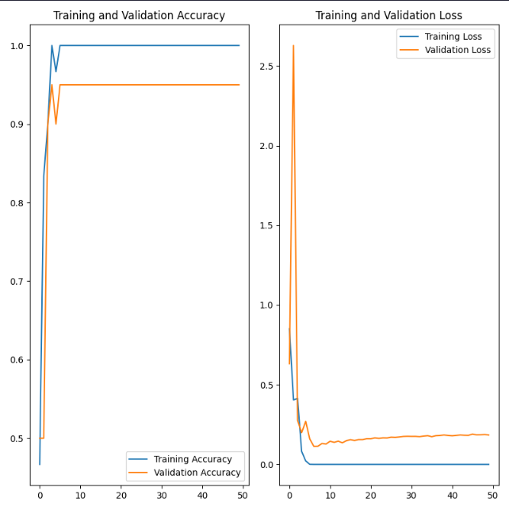

# Signature Verification Project

В этом проекте мы разработали систему верификации пользователя по его подписи, используя для этого возможности нейронной сети.

По традиции принято давать модели нейронной сети женское имя. Поэтому нашу модель мы решили назвать Helen.
## Neural Network
### Создание модели
Для создания модели нейронной сети мы использовали библиотеку TensorFlow.

Почему мы выбрали именно TensorFlow:
 
* Это открытая программная библиотека для машинного обучения, разработанная компанией Google для решения задач построения и тренировки нейронной сети с целью автоматического нахождения и классификации образов, достигая качества человеческого восприятия. Поэтому она отлично подошла для реализации нашей идеи.

### Обучение модели
Для обучения модели мы использовали образцы подписей 2-х видов по 15 штук, итого 30 подписей. Расположение датасета в проекте для обучения Train Data.

Для тестирования модели мы подготовили те же 2 вида подписей, но других экземпляров в количестве 10 штук для каждого вида. Расположение датасета в проекте для теста Test Data.

### Тест модели
На тестовых данных мы получили стабильные 95% точности модели.

Все сохраненные модели находятся в папке [models](src/models):
* [Тренированная модель](src/models/trained_model.h5)
* [Не тренированная модель, котурую можно натренировать на своем исходном датасете](src/models/model.h5)
